# Genesis AI（启元 AI 平台）

Genesis AI 是一个面向企业场景的智能知识平台，整体定位为：

- 企业级知识库平台
- 智能体编排平台
- 自主智能体 / 多智能体协同基础设施
- 支持 MCP Skills、A2UI / A2A 协议扩展

平台目标是整合前沿 AI 技术，但**当前开源版本重点是知识库平台能力**，智能体编排和多智能体能力会持续迭代完善。

## 项目背景

在知识库方案选型阶段，我们试用了 `RAGFlow`、`FastGPT`、`Dify`、`WeKnoRA`、`Coze` 等开源框架。  
在部分复杂文档场景下，常见问题是：

- 分块效果不理想
- 召回结果不稳定
- 回答质量不理想时，缺少可操作的调优参数

因此我们基于实践经验研发了启元 AI 平台：通过更细粒度的知识治理与可控参数体系，让问题可定位、可调整、可优化，而不是只能“重试运气”。

## 核心设计思路

本项目仍然采用主流的向量检索、全文检索、检索后融合评分、重排序的流程为核心来设计，只是增强了企业级权限、内容过滤、知识分层治理的能力。现有 RAG 技术（父子分块、知识图谱、RAPTOR、PageIndex）本质都在强调“**知识结构化与分层治理**”。企业知识天然存在部门、业务、文档类型分层，本项目在知识库中引入了**多层治理结构**：

- **知识库级标签**
- **文件夹层级与文件夹标签**
- **文档标签 / 文档元数据 / 文档摘要**
- **分块关键词 / 分块检索问题 / 分块摘要**

这套结构显著**增强了过滤与召回质量**，也为后续精细权限控制（如按部门可见）奠定基础。

## 界面截图

- 通用文档-文件夹目录分层

  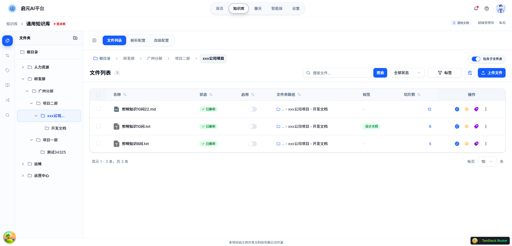

- **表格型知识库**

  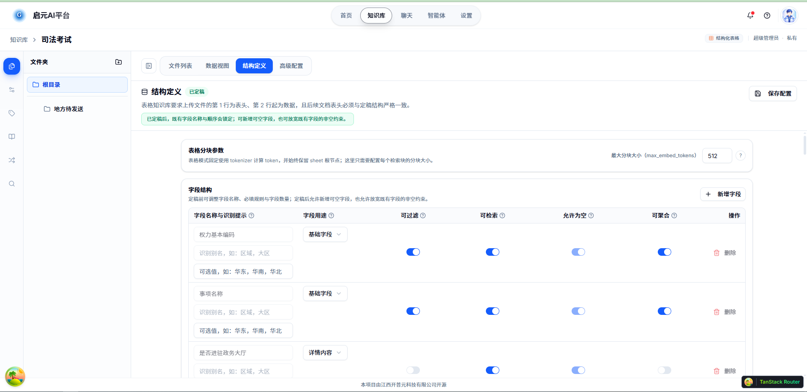
  
  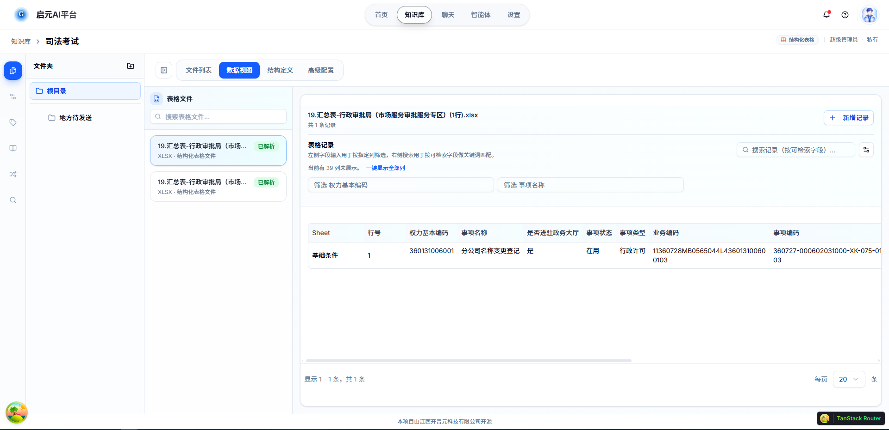

- **网页同步类型知识库**

  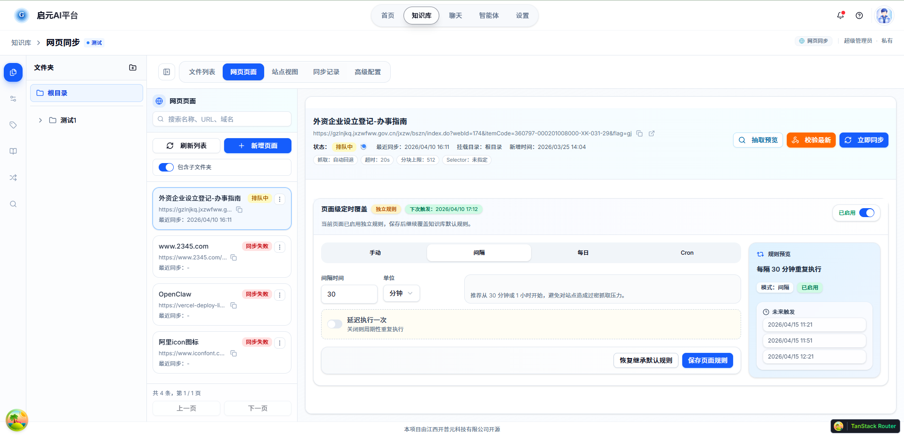

- **QA问答对知识库**

  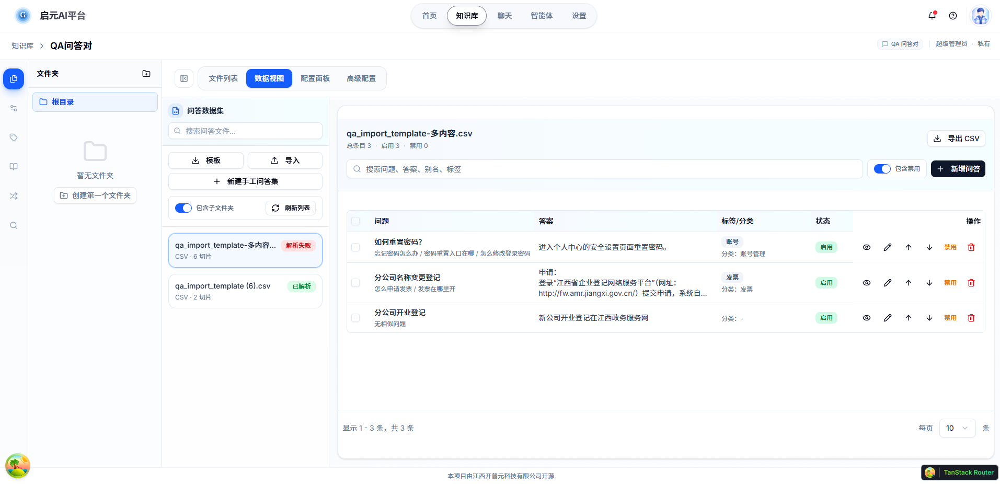

- **同义词管理**

  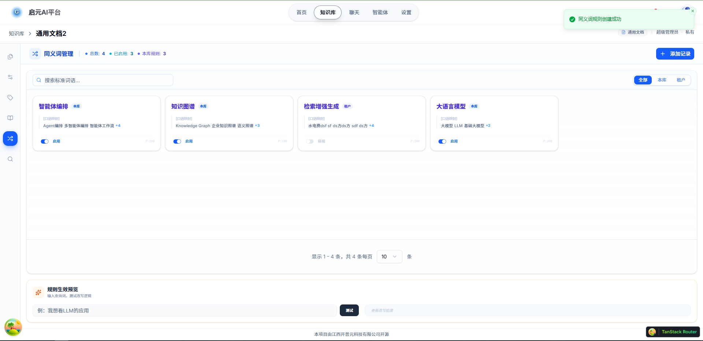

- **术语管理**

  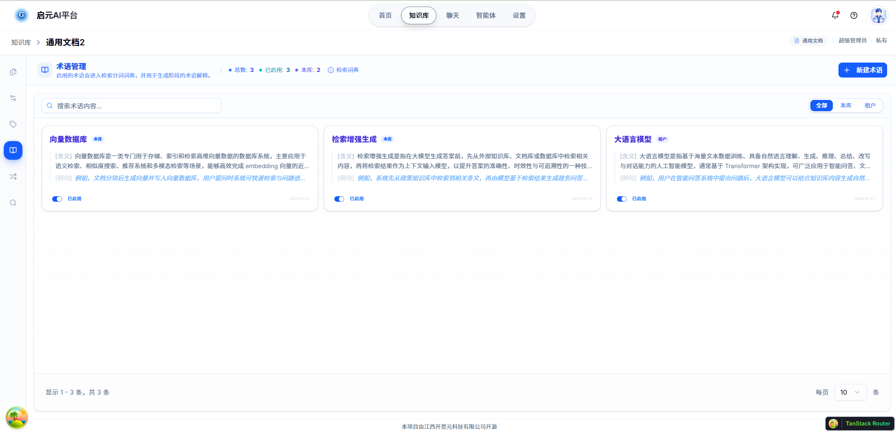

- **标签管理**

  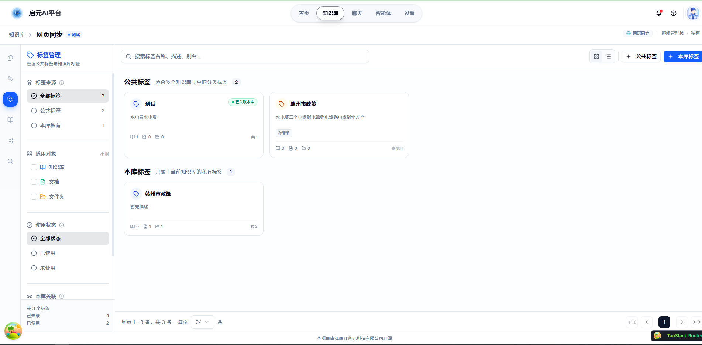

- **检索测试**

  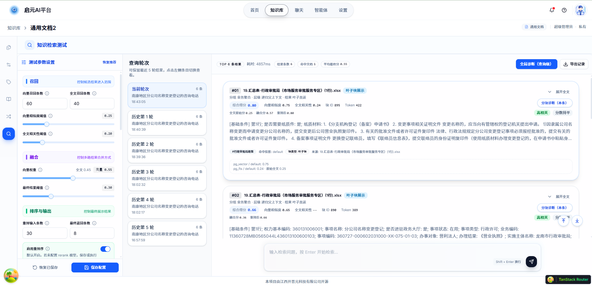

  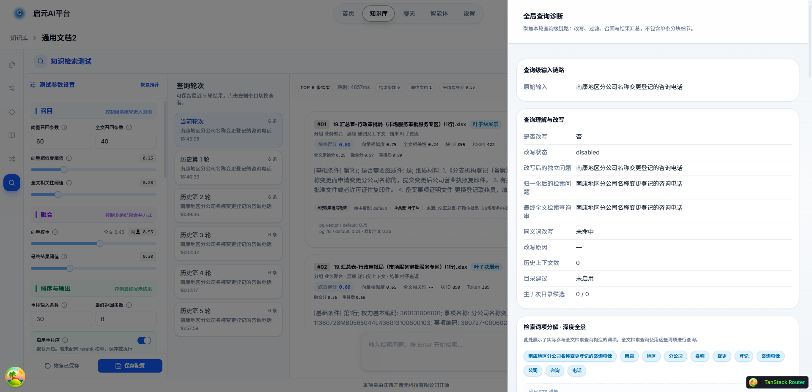

- 聊天

  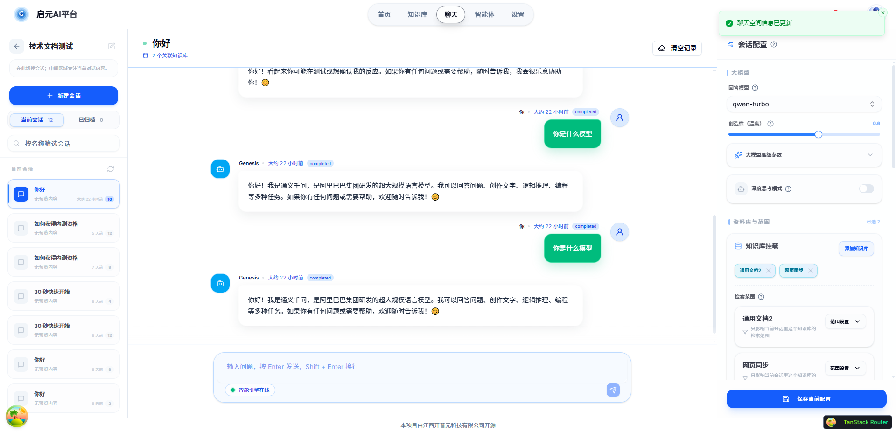

- **管理功能**

  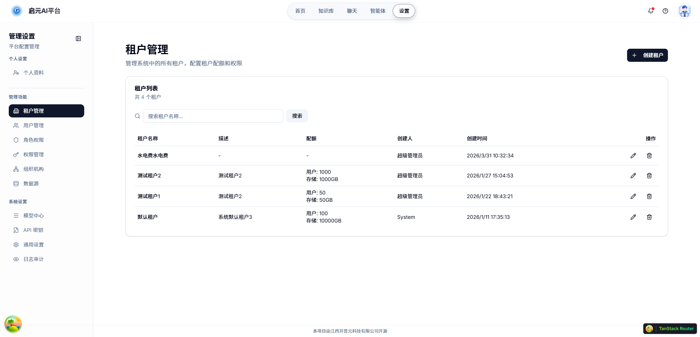

- **模型配置**

  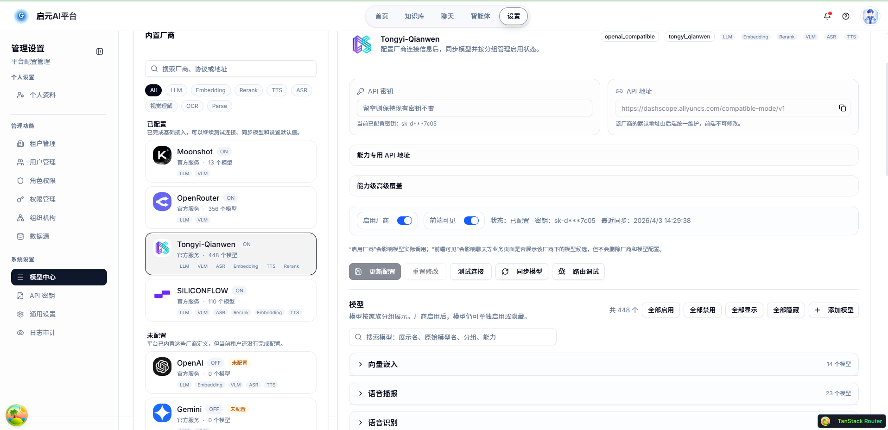

## 功能章节说明

### 1) 企业级权限与多租户

- 支持企业级多租户隔离设计
- 支持知识库共享协作场景
- 面向后续精细化权限控制（按组织、按部门、按资源层级）

### 2) 低资源检索架构

- 默认使用 PostgreSQL 承载全文检索与向量检索（低资源可落地）
- 数据规模增大时，可扩展对接 `Qdrant`、`Milvus`
- OCR支持 `Tesseract`（低资源）

### 3) 文件夹层级 + 标签/元数据体系

- 文件夹层级组织知识
- 标签与元数据增强治理能力
- 支持在召回前进行更精细过滤，减少噪声上下文

### 4) 语义增强能力

- 同义词映射
- 专业术语解释
- 上下文补充策略

目标是降低用户查询表达差异带来的召回损耗。

### 5) 文档解析与分块策略

#### 5.1 PDF 解析与 OCR

- 低资源方案：当前支持 `Tesseract`
- GPU 条件下：可使用 `MinerU`，适合复杂版面、公式和结构化内容，内置更完整的文档解析能力。<span style="color:red">需要私有化部署 MinerU</span>
- `PaddleOCR`：未来计划支持（当前版本暂不支持）
- 当前初始版本中，扫描版 PDF 会进行 OCR 识别
- 当前未引入统一 VLLM 图像识别流水线作为默认流程

#### 5.2 图片级精细控制（规划中）

现有开源框架通常只有“全量开/关”式 VLLM/OCR 开关，不够灵活。  
本项目后续会改造成“**文档内逐图控制**”，允许用户精确指定每张图是否执行 VLLM/OCR。

#### 5.3 统一中间格式

`PDF` 与 `Word` 最终统一转换为 `Markdown`，降低后续处理复杂度。

#### 5.4 表格型知识库增强

很多表格文档存在类似数据库“主键”语义，通用召回常出现 A 问题召回到 B 事项的噪声。  
本项目对表格型知识库做了增强，定义好数据结构，重点解决列级语义过滤与召回干扰问题。

#### 5.5 通用知识库分块

- 支持自定义分隔符
- 支持正则表达式分块
- 支持多级标题正则匹配
- 文档先按章节切分，再按表格/列表等独立元素切分
- 超大元素继续拆分并维护父子关系
- 章节内文本过多时结合 `chunk_size` 与父子分块策略治理

### 6) 开放 API 接入

平台提供开放 API，支持接入企业内部系统、工作流平台与智能体应用。

## 当前阶段说明

当前版本主要实现了知识库的大体流程，仍处于持续迭代阶段。 
<font color=red>在正式发布 `GA` 版本之前，不建议直接用于强生产约束环境。</font>

## 路线图（摘要）

- 完善API设计、审计日志、权限部分
- 持续优化知识库治理、检索与可观测能力
- 支持多种向量数据库
- 知识库效果评估
- 逐步引入知识图谱 / RAPTOR 等增强能力的支持
- 持续推进智能体编排与多智能体协同能力

## 技术栈

### 前端

- React 19 + TypeScript 5
- Vite 7（`@vitejs/plugin-react-swc`）
- TanStack Router（文件路由）+ TanStack Query
- Radix UI + Tailwind CSS 4 + shadcn/ui 风格组件体系
- React Hook Form + Zod（表单与校验）
- Zustand（客户端状态）
- Axios（HTTP 客户端）
- pnpm（包管理）

### 后端

- Python 3.12
- FastAPI + Uvicorn
- SQLAlchemy（asyncio）+ asyncpg + fastcrud
- Redis + Celery（异步任务）
- LiteLLM（模型接入层）
- LlamaIndex + LangChain（RAG 相关编排能力）
- pytesseract（当前 OCR 主路径）
- uv（依赖与环境管理）

### 数据与基础设施

- PostgreSQL（全文检索 + 向量检索）
- Redis（缓存 / 队列相关能力）
- Docker Compose（本地开发基础服务）
- SeaweedFS / S3 兼容对象存储 / 本地存储（按部署方案选配）

### 可选依赖与当前开源承诺

- `qdrant-client` 已预留可选依赖入口（大规模向量检索扩展）
- `paddleocr`、`docling` 在 `pyproject.toml` 中为可选依赖组
- 当前开源版本默认不启用上述可选组

## 运行方式

当前仓库提供两种推荐启动方式：

- **源码部署**：只启动基础存储组件（PostgreSQL + Redis），前后端与 Celery 继续使用本地脚本启动
- **Docker一键部署**：整个项目全部使用 Docker Compose 启动

## 启动方式一：源码启动

这个方案最适合 Windows 本地开发，特点是：

- Docker 只负责基础存储组件
- 前端、后端、Celery 仍然使用仓库内脚本启动
- 后端如需 OCR，需要在宿主机单独安装 `Tesseract`
- 默认推荐使用本地文件存储：`STORAGE_DRIVER=local`

### 1. 环境要求

- Windows 10/11
- Python 3.12.x
- Node.js 18+
- pnpm
- uv
- Docker Desktop

### 2. 克隆项目

```powershell
git clone <your-repo-url>
cd genesis-ai
```

### 3. 安装后端依赖（推荐使用一键脚本）

项目使用 **uv** 作为包管理器，并在 `genesis-ai-platform` 目录下创建独立的 `.venv` 虚拟环境。

#### 推荐方式（一键安装）：

```powershell
# 在项目根目录（genesis-ai）执行
.\setup-backend.bat
```

#### 手动安装方式：

```powershell
# 1. 确保 uv 已安装（如果没有）
winget install --id=astral-sh.uv -e

# 2. 进入目录并安装
cd genesis-ai-platform
uv python pin 3.12
uv venv --python 3.12
uv sync --frozen
```

> **重要**：安装完成后，后续所有 Python 命令**必须使用**：
>
> ```powershell
> .\genesis-ai-platform\.venv\Scripts\python.exe
> ```
> 或先激活环境：`.\.venv\Scripts\Activate.ps1`

> 注意：`.env` 是配置文件，不要删除。  
> 如需重新安装依赖，请删除 `genesis-ai-platform\.venv` 目录后重新运行 `setup-backend.bat`。

### 4. 配置后端环境变量

在 `genesis-ai-platform` 目录下执行：

```powershell
Copy-Item .env.example .env
.\.venv\Scripts\python.exe scripts/generate_secret_key.py
```

其中 `generate_secret_key.py` 用于生成高强度随机密钥，供 `.env` 中的 `SECRET_KEY` 配置使用。

建议至少确认以下配置：

```properties
DB_HOST=127.0.0.1
DB_PORT=5432
DB_USER=genesis_app
DB_PASSWORD=genesis_dev_password
DB_NAME=genesis_ai

REDIS_URL=redis://127.0.0.1:6379/0
CELERY_BROKER_URL=redis://127.0.0.1:6379/2
CELERY_RESULT_BACKEND=redis://127.0.0.1:6379/3

STORAGE_DRIVER=local
LOCAL_STORAGE_PATH=./storage-data

ROOT_PATH=/
PUBLIC_API_BASE_URL=http://127.0.0.1:8200
```

### 5. 安装前端依赖

```powershell
cd ..\genesis-ai-frontend
pnpm install
```

### 6. 启动基础存储组件（PostgreSQL + Redis）

在项目根目录执行：

```powershell
# 拷贝文件.env.example 重命名为 .env 然后填写值，也可以手动拷贝
Copy-Item .\docker\.env.example .\docker\.env
docker compose --env-file .\docker\.env -f .\docker\docker-compose.storage.yml up -d
docker compose --env-file .\docker\.env -f .\docker\docker-compose.storage.yml ps
```

**启动 SeaweedFS（可选）**：

```powershell
# 通过 profile 启用分布式对象存储
docker compose --env-file .\docker\.env -f .\docker\docker-compose.storage.yml --profile object-storage up -d
```

**停止命令**：

```powershell
# 停止基础存储服务
docker compose --env-file .\docker\.env -f .\docker\docker-compose.storage.yml down

# 停止包含 SeaweedFS 的服务
docker compose --env-file .\docker\.env -f .\docker\docker-compose.storage.yml --profile object-storage down
```

如果你所在网络环境拉取 Docker Hub 镜像较慢或超时，可以在 `docker\.env` 中覆盖镜像地址：

```powershell
# 原始镜像
# POSTGRES_IMAGE=pgvector/pgvector:pg18-trixie
# REDIS_IMAGE=redis:7-alpine
# SEAWEEDFS_IMAGE=chrislusf/seaweedfs:latest

# 网络受限时的示例镜像
POSTGRES_IMAGE=docker.m.daocloud.io/pgvector/pgvector:pg18-trixie
REDIS_IMAGE=docker.m.daocloud.io/redis:7-alpine
SEAWEEDFS_IMAGE=docker.m.daocloud.io/chrislusf/seaweedfs:latest
```

**初始化说明**：
- 首次启动时，PostgreSQL 会自动执行 `docker\postgresql\dev\init-database.sh`，并导入 `docker\postgresql\init-schema.sql` 中的业务表结构和默认主数据（包含默认租户、管理员账号等）。
- `init-schema.sql` 是权威的数据库 Schema 文件，已在 `docker-compose.storage.yml` 中正确挂载。
- 如果已有数据卷，初始化脚本**不会重复执行**。

### 7. 安装 Tesseract（宿主机）

方案 A 下，后端运行在宿主机本地，所以 **Tesseract 需要安装在你的电脑上**。

#### Windows
```powershell
# 手动下载安装包
# 下载地址：https://github.com/UB-Mannheim/tesseract/wiki
# 或：https://github.com/tesseract-ocr/tesseract/releases

# 安装后添加到 PATH 环境变量
# 并配置以下环境变量（示例）
TESSERACT_HOME=D:\Software\Tesseract-OCR
TESSERACT_TESSDATA=D:\Software\Tesseract-OCR\tessdata

# 安装中文语言包
# 下载 chi_sim.traineddata 到 Tesseract 安装目录的 tessdata 文件夹
# 下载地址：https://github.com/tesseract-ocr/tessdata/raw/main/chi_sim.traineddata
```

#### Ubuntu/Debian
```bash
sudo apt-get update
sudo apt-get install tesseract-ocr tesseract-ocr-chi-sim tesseract-ocr-eng
```

#### macOS
```bash
brew install tesseract tesseract-lang
```

### 8. 启动本地前后端与 Celery

在项目根目录分别打开 3 个终端：

```powershell
# 终端 1：后端
.\start-backend.bat

# 终端 2：前端
.\start-frontend.bat

# 终端 3：Celery（异步任务）
.\start-celery.bat
```

停止方式：

```powershell
# 关闭本地后端 / 前端 / Celery
# 方式 1：直接关闭各自打开的终端窗口
#
# 方式 2：Celery 可直接重新执行脚本，它会先停止已有 worker / beat，再重新拉起
.\start-celery.bat
```

### 9. 访问地址

默认示例配置下：

- 前端：`http://localhost:5173`  
  - 账号：admin/Admin@123456

- 后端服务：`http://localhost:8200`
- Swagger 文档：`http://localhost:8200/docs`

### 10. 方案 A 的存储说明

- 默认推荐 `STORAGE_DRIVER=local`
- 本地文件存储目录由 `LOCAL_STORAGE_PATH` 控制
- 如需使用 SeaweedFS，请单独启动 `docker/seaweedfs/docker-compose.yml`，并将后端配置切换为 `STORAGE_DRIVER=seaweedfs`
- 如果你希望把后端挂到 `/genesis-ai` 这类子路径下，请额外配置反向代理，并同步修改 `ROOT_PATH` 与 `PUBLIC_API_BASE_URL`

## 启动方式二：Docker一键启动

这个方案会通过 `docker/docker-compose.full.yml` 启动：

- PostgreSQL
- Redis
- 后端 API
- 前端静态站点
- Celery Worker / Beat（`parse`、`chunk`、`enhance`、`train`、`web_sync`、`default` 六类队列分别独立运行）
- 可选 SeaweedFS（通过 profile 启动）

### 1. 启动全量服务

在项目根目录执行：

```powershell
# 拷贝文件.env.example 重命名为 .env 然后填写值，也可以手动拷贝  密码之类的请改下
Copy-Item .\docker\.env.example .\docker\.env
docker compose --env-file .\docker\.env -f .\docker\docker-compose.full.yml up -d --build
```

如果你所在网络环境拉取 Docker Hub 镜像较慢或超时，可以在 `docker\.env` 中覆盖镜像地址：

```powershell
# 原始镜像
# POSTGRES_IMAGE=pgvector/pgvector:pg18-trixie
# REDIS_IMAGE=redis:7-alpine
# PYTHON_BASE_IMAGE=python:3.12-slim
# SEAWEEDFS_IMAGE=chrislusf/seaweedfs:latest
# NODE_BASE_IMAGE=node:20-bookworm
# NGINX_BASE_IMAGE=nginx:1.27-alpine

# 网络受限时的示例镜像
POSTGRES_IMAGE=docker.m.daocloud.io/pgvector/pgvector:pg18-trixie
REDIS_IMAGE=docker.m.daocloud.io/redis:7-alpine
PYTHON_BASE_IMAGE=docker.m.daocloud.io/library/python:3.12-slim
SEAWEEDFS_IMAGE=docker.m.daocloud.io/chrislusf/seaweedfs:latest
NODE_BASE_IMAGE=docker.m.daocloud.io/library/node:20-bookworm
NGINX_BASE_IMAGE=docker.m.daocloud.io/library/nginx:1.27-alpine
```

如果你还希望同时启动 SeaweedFS，可执行：

```powershell
docker compose --env-file .\docker\.env -f .\docker\docker-compose.full.yml --profile object-storage up -d --build
```

停止 `docker-compose.full.yml` 启动的服务：

```powershell
# 停止不带 object-storage profile 的全量服务
docker compose --env-file .\docker\.env -f .\docker\docker-compose.full.yml down

# 停止带 object-storage profile 的全量服务
docker compose --env-file .\docker\.env -f .\docker\docker-compose.full.yml --profile object-storage down
```

如果你希望在停止时同时删除数据卷（会清空 PostgreSQL / Redis / SeaweedFS / 后端持久化数据），可改用：

```powershell
docker compose --env-file .\docker\.env -f .\docker\docker-compose.full.yml down -v
docker compose --env-file .\docker\.env -f .\docker\docker-compose.full.yml --profile object-storage down -v
```

### 2. Docker一键部署说明

**Docker 镜像优化说明（重要更新）：**

- **parse-worker** 使用独立的 `Dockerfile.parse`，**仅在此容器中安装 `tesseract-ocr` 及其语言包**（eng + chi_sim）
- 其他服务（backend、chunk-worker、enhance-worker 等）使用轻量版 `Dockerfile`，**不再包含 tesseract**，可减少约 80-150MB 镜像体积
- 所有后端服务共享 Python 依赖层（uv sync），构建缓存利用率高
- 该优化显著减少了不必要的镜像体积和内存占用，同时保持功能完整

**其他说明：**

- 该方案中的 **parse-worker** 镜像已内置 `Tesseract`，宿主机无需再单独安装
- 默认仍使用本地存储：`STORAGE_DRIVER=local`
- 若要改为 SeaweedFS，需要配合 `object-storage` profile，并在 `docker/.env` 中同时配置 `STORAGE_DRIVER=seaweedfs`、`SEAWEEDFS_ENDPOINT`、`SEAWEEDFS_ACCESS_KEY`、`SEAWEEDFS_SECRET_KEY`
- 首次启动时，PostgreSQL 同样会自动执行初始化脚本，并自动导入 `docker\postgresql\init-schema.sql`
- `docker/.env.example` 现在同时承担 Docker Compose 变量模板和 Docker 后端完整配置模板
- Docker 全量部署时，后端 / Celery Worker / Beat 读取的是 `docker/.env`，不是宿主机的 `genesis-ai-platform/.env`
- `genesis_app` 的账号与密码会在首次初始化时按 `docker/.env` 中的 `DB_USER`、`DB_PASSWORD` 自动设置
- 为了和正式部署保持一致，Celery 默认按队列拆分为独立 worker；其中 `default` 队列负责低频维护与清理任务
- 本地开发与 Docker Compose 是两套启动入口：本地开发优先使用 `start-backend.bat`、`start-frontend.bat`、`start-celery.bat`；全量容器化部署优先使用 `docker compose ... up -d --build`

### 3. 访问地址

- **前端：`http://localhost:5173`  **
  - **账号：admin/Admin@123456**

- 后端服务：`http://localhost:8200`
- Swagger 文档：`http://localhost:8200/docs`

## OCR / Docling 说明（当前状态）

- 当前开源版本主路径 OCR 为 `Tesseract`
- `PaddleOCR`、`Docling` 在 `pyproject.toml` 中仅保留可选依赖入口
- 当前 README 不将其视为开源版已支持能力承诺
- 如果你需要部署 `MinerU`，可参考官方 Docker 部署文档：[MinerU Docker Deployment](https://opendatalab.github.io/MinerU/quick_start/docker_deployment/)
- 更多 OCR 补充信息可查看：`PDF_OCR相关安装.md`

## 常见问题

- `docker/dev/docker-compose.yml` 路径已不再使用，请改用 `docker/docker-compose.storage.yml` 或 `docker/docker-compose.full.yml`
- 全量 Docker 方案推荐先复制 `docker/.env.example` 为 `docker/.env`，再通过 `--env-file .\docker\.env` 启动
- Docker 全量部署时，如果你修改了 `docker/.env` 中的 `DB_NAME`、`DB_USER` 或 `DB_PASSWORD`，请在数据库首次初始化前完成；如果数据库已初始化，请按 PostgreSQL 方式手动调整数据库/用户/密码
- 后端无法启动：确认 `genesis-ai-platform\.venv` 已创建并成功 `uv sync`
- 前端无法启动：确认已安装 `pnpm` 且执行过 `pnpm install`
- 接口报数据库或 Redis 错误：确认对应 Compose 服务已经正常启动
- OCR 不生效：优先检查 `parse-worker` 日志（`docker logs genesis-ai-full-parse-worker-1`），确认 tesseract 是否正常工作
- Docker 镜像过大：现在 parse-worker 专用包含 tesseract，其他 worker 已优化为轻量版

## 开源声明

- 当前版本以“知识库主流程可用、持续迭代优化”为目标
- 功能与文档会持续更新，直到 `GA` 发布后进入更稳定阶段

