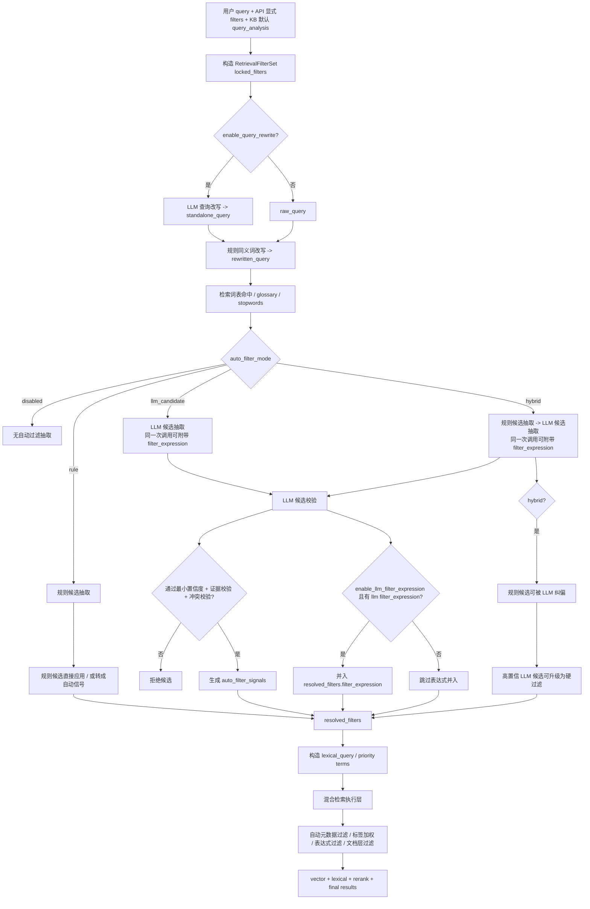

# 备忘：检索查询分析与标签过滤流程

本文用于完整说明当前 RAG 检索链路中：

- 文档标签 / 文件夹标签过滤怎么生效
- 同义词改写、检索词表、分词、LLM 查询分析的执行顺序
- LLM 查询分析到底做什么，以及关闭后系统如何工作
- `llm_candidate / hybrid / filter_expression / auto_filter_signals` 的真实责任边界
- 检索测试参数如何覆盖知识库默认配置

## 1. 核心结论

当前检索主链已经拆成两个独立的 LLM 职责：

当前实现更准确地说是：

1. 先接收用户显式过滤条件。
2. 可选执行 LLM 查询改写，先产出 `standalone_query`。
3. 再做规则型同义词改写。
4. 再命中知识库级检索词表，生成全文检索优先词 / 优先短语。
5. 可选执行规则型或 LLM 型过滤候选提取 / 统一过滤表达式。
6. 最后构造 `rewritten_query`、`lexical_query` 与 `retrieval_filters`，供向量检索和全文检索统一消费。

其中：

- 查询改写 LLM：负责把问题改成更适合检索的独立问题，并可附带目录建议
- 表达式 / 候选 LLM：负责在一次调用里同时尝试输出过滤候选和可选的统一过滤表达式

### 1.1 总体流程图



### 1.2 必须先记住的边界

1. `LLM 统一过滤表达式` 不是额外一次模型调用，而是“LLM 候选抽取”这一次调用的附带输出。
2. `llm_candidate` 模式下，LLM 不是只做展示。通过校验的元数据候选会被转换成 `auto_filter_signals`，并在检索阶段形成实际过滤效果。
3. `硬过滤升级阈值` 与 `最大升级数量` 当前只对 `hybrid` 生效，因为只有 `hybrid` 分支会执行“LLM 候选升级为硬过滤”。
4. `LLM 最小置信度` 先于自动信号生效。低于阈值的 LLM 候选会直接被拒绝，根本不会进入 `auto_filter_signals`。
5. API / 前端显式过滤永远是锁定硬过滤。LLM 只能补充、收紧，不能放宽或覆盖它。

## 2. 入口与主要文件

主要入口：

- 检索测试页：`genesis-ai-platform/api/v1/knowledge_bases.py` 中的 `/retrieval-test`
- 聊天链路：`genesis-ai-platform/services/chat/retrieval_context.py`
- 统一检索主链：`genesis-ai-platform/rag/retrieval/hybrid.py` 中的 `HybridRetrievalService.search()`

查询分析：

- `genesis-ai-platform/rag/query_analysis/service.py`
- `genesis-ai-platform/rag/query_analysis/types.py`

全文分词与 PG FTS 查询载荷：

- `genesis-ai-platform/rag/lexical/analysis/jieba_analyzer.py`
- `genesis-ai-platform/rag/lexical/analysis/pg_payload.py`
- `genesis-ai-platform/rag/lexical/service.py`

向量 / 全文检索后端：

- `genesis-ai-platform/rag/retrieval/backends/pg_vector.py`
- `genesis-ai-platform/rag/retrieval/backends/pg_fts.py`

## 3. 完整执行顺序

### 3.1 显式过滤条件先进入 RetrievalFilterSet

前端或聊天绑定传入的过滤条件会先规范化为 `RetrievalFilterSet`，常见字段包括：

- `kb_doc_ids`
- `document_ids`
- `content_group_ids`
- `folder_ids`
- `tag_ids`
- `folder_tag_ids`
- `document_metadata`
- `search_unit_metadata`
- `include_descendant_folders`
- `only_tagged`

这一步不依赖 LLM。

如果用户已经在界面上选择了目录或标签，这些就是明确的硬过滤条件。

### 3.2 LLM 查询改写（独立问题）

如果 `enable_query_rewrite = true`，系统会先判断是否值得调用查询改写 LLM。

当前最佳实践策略：

- 聊天场景：如果存在最近几轮上下文，可调用
- 检索测试：默认没有历史上下文；只有在知识库存在有效多级目录时，才会调用并尝试顺带产出目录建议
- 如果没有多轮上下文且只有根目录，系统会直接跳过，不做无意义改写

输出包括：

- `standalone_query`
- `query_rewrite_debug`
- 可选 `folder_routing_hints`

注意：

- 目录建议只在存在有效多级目录时启用
- 只有根目录时，不启用目录建议，提示词也会明确这一点
- 当前目录建议只进入诊断，不直接变成硬过滤

`folder_routing_hints` 当前的实际作用：

1. 作为查询改写阶段的调试产物返回，方便在检索测试页 / 诊断面板里观察：
   - LLM 是否识别到了可能相关的目录范围
   - 主候选目录和次候选目录分别是什么
   - 模型给出该建议的简短原因
2. 用于人工判断“这个问题是否天然带目录范围”，帮助排查：
   - 为什么当前没有自动目录过滤
   - 如果未来要把目录建议升级成更强的自动范围能力，当前提示词和候选质量是否足够
3. 当前不会直接写入：
   - `resolved_filters.folder_ids`
   - `filter_candidates`
   - `auto_filter_signals`
   也就是说，它不会直接影响本轮检索范围，不会自动变成硬过滤或加权信号。

可以把它理解为：

```text
folder_routing_hints = 查询改写阶段附带产出的“目录范围建议”
                   = 当前用于诊断和人工观察
                   != 当前已落地的自动过滤条件
```

未来如果要增强它，比较合理的方向通常有两种：

1. 仍保持“只做诊断建议”
   - 优点：风险最低，不会误缩窄范围
2. 在满足更严格条件时，转换成目录候选或弱过滤信号
   - 例如需要：
     - 高置信度
     - 与 query 文本证据一致
     - 与显式过滤不冲突
   - 但这属于后续设计，不是当前实现

### 3.3 同义词改写

随后进入 `QueryAnalysisService.analyze()`。

如果 `enable_synonym_rewrite = true`，会先调用 `_rewrite_query_by_synonyms()`。

它从 `kb_synonyms` / `kb_synonym_variants` 读取规则，把用户 query 中命中的别名替换成标准词。

示例：

```text
原始 query：剪影空间怎么上传？
同义词规则：剪影 -> 剪映
rewritten_query：剪映空间怎么上传？
```

注意：

- 这是规则替换，不是 LLM 改写。
- 会按词长度降序匹配，减少短词先吃掉长词的问题。
- 同义词命中会生成 `synonym_matches`，后续全文检索可使用扩展词。

同义词改写当前位于查询改写之后。

原因：

- 查询改写需要优先理解原始用户表达和多轮省略关系
- 先做 standalone query，再做同义词标准化，更稳
- 这样全文检索与规则过滤看到的是“补全后且已术语归一化”的问题

### 3.4 检索词表命中

接着调用 `_apply_retrieval_lexicon()`。

它读取知识库级检索词表，匹配：

- `term`
- `aliases`
- `weight`
- `is_phrase`

当前实现不会把命中的词表项重复拼进 `rewritten_query`，而是生成后续全文检索使用的提示信息：

- `retrieval_lexicon_matches`
- `priority_lexical_terms`
- `priority_lexical_phrases`
- `lexicon_weights`

这样做的目的：

- 保持 `rewritten_query` 简洁
- 避免 query 被词表无限膨胀
- 让词表项通过分词自定义词和短语补分发挥作用

### 3.5 检索忽略词 / 停用词处理

随后会整理 `retrieval_stopwords`。

它用于：

- 过滤低价值 query 词项
- 阻断中文 fallback bigram 中的噪声片段
- 在调试信息里展示 `ignored_lexical_terms`

### 3.6 可选自动过滤提取

这里由 `auto_filter_mode` 控制。

可选值：

```text
disabled      不做自动过滤提取
rule          只做规则型过滤提取
llm_candidate 只做 LLM 候选提取
hybrid        规则先抽取，LLM 再做补充 / 纠偏 / 表达式化
```

#### disabled

不从 query 里自动识别标签 / 文件夹 / 元数据。

系统只使用用户显式传入的过滤条件。

#### rule

调用规则匹配：

- `_match_folders()`：匹配文件夹名称、完整路径、摘要
- `_match_tags()`：匹配标签名称、标签别名
- `_match_metadata_fields()`：匹配 schema 中明确声明的枚举值

只有高置信命中才会写入硬过滤。

#### llm_candidate

调用 `_extract_llm_filter_candidates()`。

LLM 会拿到当前知识库的候选列表，例如：

- folders
- doc_tags
- folder_tags
- metadata_fields
- rule_candidates

LLM 在这一模式下的输出结构并不只有 `candidates`，而是：

1. `candidates`
2. 可选 `filter_expression`

但它不会执行 `hybrid` 专属的“规则纠偏 + 候选升级为硬过滤”。

当前真实行为是：

1. LLM 返回候选和可选表达式
2. 候选先过：
   - `LLM 最小置信度`
   - 查询证据校验
   - schema / 冲突校验
3. 通过校验的 LLM 元数据候选会转成 `auto_filter_signals`
4. `document_metadata / search_unit_metadata` 类型信号会在检索阶段形成实际过滤效果
5. `doc_tag / folder_tag` 类型信号只参与加权，不直接形成硬过滤
6. 如果本次 LLM 还返回了 `filter_expression`，且 `enable_llm_filter_expression = true`，该表达式也会并入最终过滤

所以 `llm_candidate` 不是“只展示、不生效”，而是：

```text
候选校验
  -> 元数据候选可形成自动过滤
  -> 标签候选主要形成加权
  -> 可选 filter_expression 形成追加硬过滤
  -> 不执行 hybrid 专属的候选升级为硬过滤
```

#### hybrid

先做规则提取，再做 LLM 候选提取。

这里要特别注意责任边界：

- API / 前端显式过滤：是 `locked_filters`，优先级最高
- 规则命中：是 `rule_candidates`
- LLM：不是改 API 显式过滤，而是对规则候选做补充、纠偏和复杂表达式化

当前实现语义是：

1. 规则先抽取 `rule_candidates`
2. 把 `rule_candidates + 候选标签/目录/元数据字段` 传给 LLM
3. LLM 输出 `candidates` 和可选的 `filter_expression`
4. 后端校验：
   - 不允许与 `locked_filters` 冲突
   - 允许在 `hybrid` 模式下对同目标规则候选做纠偏
5. 合并：
   - 规则候选先落到系统侧
   - 高置信 LLM 候选可继续追加
   - LLM 表达式以 `AND` 方式并入现有表达式，只允许收紧，不允许放宽

因此它不是“规则先定案，LLM只能附和”，而是：

```text
显式过滤锁定
    -> 规则先抽取
        -> LLM 对规则做补充 / 纠偏 / 结构化
            -> 后端按优先级合并
```

LLM 失败时会降级，不影响主检索链。

### 3.6.1 LLM 候选校验的真实顺序

对 `llm_candidate / hybrid` 两个模式，LLM 候选的真实处理顺序是：

1. LLM 返回 `candidates`
2. 检查 `confidence >= llm_candidate_min_confidence`
3. 检查是否存在查询证据
   - `raw_query`
   - `standalone_query`
   - `rewritten_query`
   - `rule_candidates` 支撑
4. 检查是否与显式过滤冲突
5. 检查元数据值是否在 schema 可选值中
6. 通过后才允许：
   - 进入 `auto_filter_signals`
   - 在 `hybrid` 下进一步参与升级

因此：

```text
LLM 最小置信度
    -> 是“候选能不能继续往下走”的前置门槛
```

### 3.6.2 auto_filter_signals 到底是什么

`auto_filter_signals` 是“候选经过校验后，被转换成检索阶段可消费的信号层”。

它不是最终 SQL，也不是最终硬过滤集合，但它会影响检索：

- `doc_tag`
  - 作用：标签加权
  - 效果：不直接过滤范围
- `folder_tag`
  - 作用：标签加权
  - 效果：不直接过滤范围
- `document_metadata`
  - 作用：自动文档元数据过滤
  - 效果：会实际过滤文档范围
- `search_unit_metadata`
  - 作用：自动搜索单元 / QA / 表格行元数据过滤
  - 效果：会实际过滤搜索单元范围

### 3.6.3 什么情况下会有实际过滤效果

对 `llm_candidate` 模式，最容易被误解的是：

```text
没有 filter_expression，为什么还是过滤了？
```

答案是：因为“元数据候选 -> auto_filter_signals -> 自动元数据过滤”这条链路本身就会形成过滤效果。

具体条件如下：

1. 候选来自 LLM
2. 候选类型是 `document_metadata` 或 `search_unit_metadata`
3. 候选满足 `LLM 最小置信度`
4. 候选通过证据校验、schema 校验、冲突校验
5. 对应字段已在 `metadata_fields` 白名单中声明
6. 候选被转换成自动元数据过滤信号
7. 检索阶段按 `match_mode` 应用

`match_mode` 当前含义：

- `match_only`
  - 只保留字段值命中的结果
- `match_or_missing`
  - 保留“字段值命中”或“字段缺失”的结果
  - 字段存在但值不匹配时过滤

### 3.7 术语 glossary

随后 `_resolve_glossary_entries()` 会根据改写后的 query 和同义词命中，找相关专业术语解释。

glossary 主要用于：

- 生成阶段的术语上下文
- 全文检索优先词 / 短语补充

它不直接作为文档硬过滤条件。

### 3.8 构造 lexical_query

最后 `_build_lexical_query()` 构造全文检索专用查询。

它会综合：

- `rewritten_query`
- `raw_query`
- 同义词标准词
- 同义词扩展词
- 检索忽略词过滤结果

得到 `lexical_query`。

向量检索通常使用 `rewritten_query`。

全文检索使用 `lexical_query`，并额外消费：

- `priority_lexical_terms`
- `priority_lexical_phrases`
- `synonym_terms`
- `glossary_terms`
- `retrieval_stopwords`
- `lexicon_weights`

## 4. LLM 查询分析到底做什么

LLM 查询分析当前的职责是“在一次调用里提取过滤候选 + 输出受控过滤表达式”。

它不是当前主链里的通用问句改写器。

它可以尝试从用户问题中识别：

- `folder_id`
- `tag_id`
- `folder_tag_id`
- `document_metadata`
- `search_unit_metadata`

示例：

```text
用户问题：只看产品手册目录下，安装指南标签里的剪映空间上传说明
```

LLM 可能输出候选：

```json
{
  "candidates": [
    {
      "filter_type": "folder_id",
      "target_id": "产品手册对应的 folder.id",
      "filter_value": "产品手册",
      "confidence": 0.86,
      "reason": "用户明确提到产品手册目录"
    },
    {
      "filter_type": "tag_id",
      "target_id": "安装指南对应的 tag.id",
      "filter_value": "安装指南",
      "confidence": 0.88,
      "reason": "用户明确提到安装指南标签"
    }
  ]
}
```

LLM 输出后还要走后端校验：

- 置信度不能低于最小阈值
- 对目录 / 标签类候选，必须有查询证据，不能只因为候选池存在就命中
- 候选 id 必须在给定候选列表中
- 不能和用户显式过滤冲突
- metadata 候选值必须符合 schema 可选值

在 `hybrid` 模式下，如果 LLM 与规则候选在同一目标上冲突：

- 不会推翻 API 显式过滤
- 可以纠偏规则候选
- 被纠偏的规则候选会标记为 `corrected_by_llm`

因此它不是“LLM 说了就算”，而是受约束的候选增强与表达式增强。

## 5. API、规则、LLM 的优先级

### 5.1 API / 前端显式过滤

包括：

- `folder_ids`
- `tag_ids`
- `folder_tag_ids`
- `document_metadata`
- `search_unit_metadata`
- `filter_expression`

这些属于调用方显式指定的硬过滤，优先级最高。

它们的规则是：

- 先进入 `RetrievalFilterSet`
- LLM 不能覆盖或放宽
- 如果 LLM 额外返回表达式，只能通过 `AND` 继续收紧
- `locked_filters` 不传给 LLM，由后端独立负责校验与最终合并

### 5.2 规则候选

规则层负责从 query 中提取高确定性信号：

- 文件夹
- 标签
- 元数据枚举值

但不是所有规则候选都会直接成为硬过滤：

- 自动标签候选：默认只作为加权信号
- 自动元数据候选：默认走自动元数据过滤
- 文件夹候选：高置信时可成为硬过滤

### 5.3 LLM 候选、自动信号与表达式

LLM 输出分两类：

1. `candidates`
   - 先经过最小置信度和证据校验
   - 标签候选默认进入加权信号
   - 元数据候选默认进入自动元数据过滤
   - `hybrid` 模式下可对同目标规则候选做纠偏
   - 只有 `hybrid` 下高置信 LLM 候选才会继续升级为硬过滤

2. `filter_expression`
   - 一旦通过后端校验并落地，就是硬过滤
   - 不做排序加权
   - 与 API 已有表达式的合并方式固定为 `AND`

### 5.4 一句话记忆

```text
API 显式过滤 = 锁定硬过滤
自动标签候选 = 加权
自动元数据候选 = 自动过滤
LLM 过滤表达式 = 追加硬过滤（AND 收紧）
Hybrid 高置信 LLM 候选 = 可升级为硬过滤
```

## 6. 如果不启用 LLM，会怎样

可以不启用。

当前系统在不启用 LLM 的情况下仍能正常检索。

当 `auto_filter_mode = disabled` 时：

- 不做规则过滤提取
- 不做 LLM 候选提取
- 只使用用户显式传入的目录 / 标签 / 元数据过滤
- 仍然执行同义词改写
- 仍然执行检索词表命中
- 仍然执行 glossary 命中
- 仍然执行 jieba 分词
- 仍然执行向量 + 全文混合召回

当 `auto_filter_mode = rule` 时：

- 不使用 LLM
- 会用规则匹配 query 中明确出现的文件夹名、标签名、标签别名、枚举元数据值
- 命中置信度足够高才写入硬过滤

推荐理解：

```text
LLM 查询分析 = 可选的过滤候选增强
规则过滤 = 更可控的轻量自动识别
显式过滤 = 用户界面选择的最高可信硬过滤
同义词 / 检索词表 / jieba = 不依赖 LLM 的检索基础能力
```

## 7. 标签与文件夹过滤怎么生效

### 6.1 文档标签 tag_ids

`tag_ids` 表示知识库文档标签。

存储位置：

- 表：`resource_tags`
- `target_type = "kb_doc"`
- `target_id = knowledge_base_documents.id`

过滤语义：

- 多个 `tag_ids` 是 AND 关系
- 文档必须同时拥有这些标签才命中

实现口径：

```text
ResourceTag.target_type == "kb_doc"
ResourceTag.action == "add"
GROUP BY ResourceTag.target_id
HAVING count(distinct ResourceTag.tag_id) >= len(tag_ids)
```

### 6.2 文件夹标签 folder_tag_ids

`folder_tag_ids` 表示文件夹标签。

存储位置：

- 表：`resource_tags`
- `target_type = "folder"`
- `target_id = folders.id`

处理流程：

1. 先用 `folder_tag_ids` 找到带这些标签的 folder id。
2. 如果同时传了 `folder_ids`，再和显式 `folder_ids` 取交集。
3. 根据 `include_descendant_folders` 决定是否扩展子文件夹。
4. 用最终 folder id 集合过滤 `knowledge_base_documents.folder_id`。

### 6.3 目录 folder_ids

`folder_ids` 表示用户显式选择的目录。

默认：

```text
include_descendant_folders = true
```

也就是会包含子目录中的文档。

目录树扩展依赖 `folders.path`，当前是 PostgreSQL `ltree` 风格路径。

## 8. QA / 表格的特殊过滤

普通文档标签和文件夹过滤作用在 `knowledge_base_documents` 文档层。

但 QA 和表格还有主事实表过滤：

### 7.1 QA

QA 的分类 / 标签过滤不应误塞到文档级 metadata。

当前 `_apply_qa_filter_mapping()` 会把：

- `category`
- `tag`
- `tags`

从 `document_metadata` 映射到：

```text
search_unit_metadata.qa_fields
```

然后 `_resolve_qa_content_group_ids()` 先查 `kb_qa_rows`，再把命中的 QA row id 映射成 `content_group_ids` 约束检索层。

### 7.2 表格

表格字段过滤会从 `document_metadata` 映射到：

```text
search_unit_metadata.filter_fields
```

然后 `_resolve_table_content_group_ids()` 先查 `kb_table_rows.row_data`，再把命中的行 id 映射成 `content_group_ids` 约束检索层。

这样做是为了让结构化过滤以主事实表为准，而不是只依赖冗余 metadata。

## 9. 分词与全文检索

当前不是使用 PostgreSQL 中文分词扩展。

当前策略是：

```text
应用层 jieba 分词 + PG simple FTS
```

### 8.1 查询侧

`build_pg_fts_query_payload()` 会基于 `JiebaLexicalAnalyzer` 生成：

- `strict_query_text`
- `loose_query_text`
- `fallback_query_text`
- `phrase_pattern`
- `priority_term_weights`
- `priority_phrase_weights`

PG FTS 后端使用：

- `plainto_tsquery('simple', strict_query_text)`
- `to_tsquery('simple', loose_query_text)`
- `to_tsquery('simple', fallback_query_text)`

同时使用 `ILIKE` 对已经被 FTS 召回的候选做短语 / 优先词补分。

### 8.2 索引侧

`SearchUnitLexicalIndexService` 会对 `chunk_search_units` 的 `search_text` 或 `metadata.lexical_text` 构建全文索引文本。

它会把：

- 规范化原文
- jieba 词项
- 命中的知识库检索词表
- glossary 术语
- 低权重 fallback ngram

拼成更适合 `to_tsvector('simple', search_text)` 的文本，再写入：

```text
pg_chunk_search_unit_lexical_indexes
```

### 8.3 为什么不用 PG 中文分词扩展

当前文档结论是：

- 不急着引入 `zhparser` / `pg_jieba` 等 PG 内扩展
- 先使用统一应用层 analyzer
- 好处是更容易接入知识库词表、同义词、术语、停用词
- 后续迁移到 Qdrant / Milvus 时，应用层 query analysis 和 query expansion 更容易复用

## 9. 后续注意点

当前需要特别留意一个潜在边界：

如果只传了 `folder_tag_ids`，但没有任何文件夹匹配这些标签，理论上应返回空结果。

后续如果看到“文件夹标签过滤没生效、结果反而全库放开”的情况，应优先检查：

- `HybridRetrievalService._resolve_candidate_filters()`
- `HybridRetrievalService._resolve_folder_ids_by_tags()`
- `HybridRetrievalService._expand_folder_ids()`

可以补一个测试覆盖：

```text
folder_tag_ids 非空
匹配 folder ids 为空
期望 filter_applied = true 且最终结果为空
```
