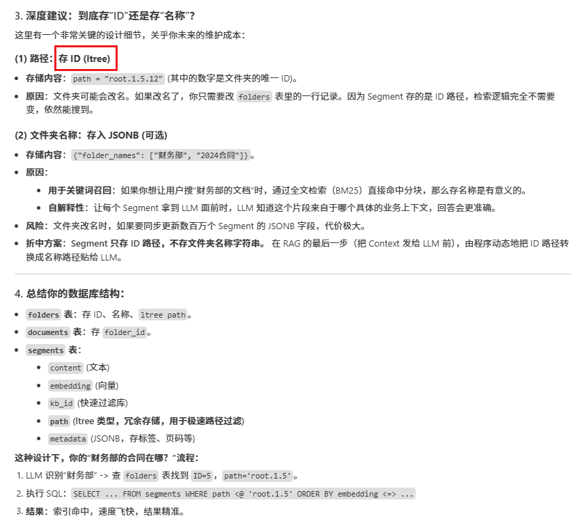

# 文件夹与标签系统深度设计：实现物理-逻辑解耦的高性能资产管理

## 1. 核心架构：三层解耦设计 (Asset Vault Strategy)

为了实现极高的灵活性并兼顾“资产管理”与“业务闭环”，系统采用“物理-逻辑-应用”三层分离架构。

### 1.1 三层定义
*   **物理层 (Physical Store)**：由 `documents` 表负责。所有文件上传后执行 Hash 去重，物理实体在租户内唯一。它不感知具体的知识库业务。
*   **资产逻辑层 (Asset Mapping)**：由 `asset_folder_documents` 表负责。管理资产在“全局资产库（网盘视角）”中的位置、排序和置顶状态。它解决的是“文件存在哪”的问题。
*   **业务关联层 (Business Mapping)**：由 `knowledge_base_documents` 表负责。管理资产到具体“知识库（RAG 视角）”的挂载关系，记录解析状态、配置、摘要及日志。它解决的是“文件如何用”的问题。

### 1.2 产品逻辑与交互流向
系统区分 **【文件管理】(网盘视角)** 与 **【知识库】(业务视角)** 两个核心入口。

1.  **业务入口逻辑**：
    *   **【文件管理】菜单**：租户级的资产大本营。支持新建文件夹、上传文件、全局打标。此处的层级关系由 `asset_folder_documents` 维护。
    *   **【知识库】菜单**：业务空间。支持“直接上传”或“从资产库添加（挂载）”。此处的层级关系由 `knowledge_base_documents` 维护。
2.  **数据流向规则**：
    *   **上传即入库**：无论从哪个入口上传，物理实体统一进入 `documents` (资产库) 并执行物理去重，实现秒传。
    *   **全局可见性 (Auto-Sync)**：在知识库中直接上传的文件，系统会**自动**在 `asset_folder_documents` 中建立一条记录，通常归宿于一个预设的目录（如 `/知识库上传`）。这确保了所有资产都能在“网盘视角”被统一管理。
    *   **多库挂载**：同一个资产库文件，可以被挂载到多个不同的知识库中。
    *   **目录结构隔离**：知识库可以建立完全不同于资产库的文件夹层级。

---

## 2. 标签与元数据：三级全覆盖设计 (Tag & Metadata Matrix)

系统通过标签（侧重人）和元数据（侧重系统/算法）构建了完整的多维过滤体系。

| 级别 | 标签 (Tags) —— 侧重人工/分类管理 | 元数据 (Metadata) —— 侧重属性/算法检索 |
| :--- | :--- | :--- |
| **文件夹** | ✅ **手动分类**。如“重要”。支持跨路径的横向打标。 | ❌ 基本不用。 |
| **文档(物理)** | ✅ **手动分类/筛选**。如“合同”、“内部”。 | ✅ **物理溯源**。存储原作者、解析状态、Seaweedfs Hash。 |
| **文档(逻辑)** | ✅ **业务加标**。在特定 KB 中生效的标签。 | ✅ **业务属性**。如有效期、适用部门。仅在当前 KB 生效。 |
| **分块 (Segment)** | ✅ **自动关键字 (Keywords)**。由 LLM 提取，作为检索特征。 | ✅ **核心检索属性**。页码、坐标、QA 对（自动生题）。 |

### 2.1 关键技术特性
*   **继承机制 (Inheritance)**：RAG 性能的核心。文档级的标签在入库分块时，会自动沉降并冗余存储在分块的 `metadata` (JSONB) 中。
*   **Self-Query 支持**：系统支持通过 LLM 从用户问题中提取元数据约束（如：“查张三去年的报告” -> `{author: '张三', year: 2023}`），并转化为数据库硬过滤。
*   **标签别名**：`tags` 表支持 aliases，解决“AI”与“人工智能”等术语不一致导致的分类隔离问题。

### 2.2 全局标签管理与语义对齐 (Global Tag Management)

为了防止多维度下的标签冲突，系统建立“租户级标签中心”，实现从“乱”到“治”：

1.  **标签别名管理 (Aliases)**：
    *   **功能**：在全局中心将“AI”、“人工智能”、“LLM”关联为同一个标签 ID。
    *   **RAG 价值**：用户问任何一个词，系统都能精准命中这三类文档。
2.  **标签语义热更新**：
    *   **功能**：在全局中心统一维护标签的 `description`。
    *   **RAG 价值**：当业务变动时（如“合规”范围扩大了），只需修改一处描述，全系统所有基于该标签的 AI 意图识别自动同步更新。
    *   **冲突处理**：当逻辑库标签与全局标签冲突时，系统采用“叠加”而非“覆盖”策略，确保合规性（如：全局标记为“禁阅”，局部标记为“可读”，最终效果为“禁阅”）。
    
### 2.3 元数据分层与合并策略 (Metadata Layering)

针对用户关于“documents 与 knowledge_base_documents 元数据关系”的疑问，系统采用 **“固有属性 + 业务属性 = 最终检索属性”** 的合并策略。**documents.metadata 不需要也不应该删除**。

| 层级 | 字段位置 | 性质 | 典型内容 | 作用 |
| :--- | :--- | :--- | :--- | :--- |
| **L1 物理层** | `documents.metadata` | **固有/不可变** | 页数、原作者、分辨率、文件创建时间、MIME类型。 | 文件的“DNA”。无论传到哪个库，这些事实不会变。 |
| **L2 逻辑层** | `kb_docs.metadata` | **业务/上下文** | 生效年份、适用部门、密级、项目代号。 | 文件的“身份”。在 A 库是“参考资料”，在 B 库可能是“审计凭证”。 |
| **L3 最终层** | `chunks.metadata` | **检索用** | `{...L1, ...L2, page: 5}` | **RAG 检索时的直接过滤对象**。 |

**合并规则 (Merge Strategy)**：
当文件被切片入库时，系统执行以下逻辑：
```python
final_metadata = document.metadata.copy()  # 1. 继承物理底座
final_metadata.update(kb_doc.metadata)     # 2. 注入业务上下文 (以此为准)
final_metadata.update(chunk_specific_data) # 3. 注入切片特有数据 (页码等)
```
**场景举例**：
*   **物理层**：识别出某 PDF 作者是 "Adobe"。
*   **逻辑层**：在“财务库”中，管理员设置该文件 `department: "Finance"`。
*   **结果**：用户搜“Adobe 写的关于 Finance 的文档”时，两个元数据同时发挥作用。

---

## 3. 高性能树形架构：ltree 方案

对于租户组织架构 (`organizations`) 和 知识库目录 (`folders`)，系统统一采用 PostgreSQL 的 **ltree** 扩展，弃用传统的递归查询。

### 3.1 方案优势
*   **路径冗余存储**：存储类似 `root.sub1.sub2` 的路径字符串。
*   **秒级检索**：支持 GIST 索引，一键获取整棵子树或溯源完整面包屑，性能相比 CTE 递归提升 10 倍以上。
*   **业务赋能**：在 RAG 检索时，用户可以指定“仅在特定目录及其子目录下搜索”，数据库层实现硬件加速。

### 3.2 目录挂载策略与标签穿透 (Advanced Logic)

#### 3.2.1 目录挂载
当用户将资产库文件夹 `Src_Folder` 挂载到知识库 `KB_Folder` 时：
*   **默认 (Flatten)**：源下所有文件逻辑映射到 `KB_Folder` 下，原有物理层级在当前 KB 视口下抹平。
*   **可选 (Mirror)**：系统递归克隆逻辑目录树。

#### 3.2.2 标签作用域与重载机制 (Tag Scope & Override)
为了支持“默认继承资产库，但各库可独立定制”的极高灵活性，系统采用 **Scope 作用域关联**：

1.  **全局层 (Asset Scope)**：`KB_ID` 为空的标签关联。描述文件的本质属性。
2.  **局部层 (Context Scope)**：`KB_ID` 挂载特定知识库。描述在该业务场景下的特定标签。
3.  **计算逻辑 (Effective Tags)**：
    *   知识库视口看到的标签 = `{全局层} + {局部区新增} - {局部区屏蔽}`。
    *   **优点**：初始挂载时自动继承全局底色；用户在库内修改标签时，通过在 `resource_tags` 插入带 `KB_ID` 的记录来“覆盖”底色，不影响物理原件和其他库。

#### 3.2.3 编辑权责划归 (Responsibility)
*   **网盘修改**：影响所有尚未进行“局部重载”的知识库。
*   **库内修改**：自动触发 Scope 锁定，修改仅在当前 `KB_ID` 下生效，实现业务隔离。

---

## 4. 业务操作与数据流向深度同步案例 (Workflow Walkthrough)

为了彻底理解整个系统的解耦运行机制，我们模拟一份文件从产生到在多个业务场景下演进的全过程。

### 场景：一份《2024年员工手册.pdf》的生命周期

#### 第一步：资产池物理上传（建立底座）
用户在全局资产管理界面的“规章制度”文件夹（ID: `F-Global`）下上传了该 PDF。
注意：下面的{Tag }记录，指的是resource_tags表。

*   **物理层 (`documents`) —— 资产落盘**：
    | id | name | content_hash | file_key |
    | :--- | :--- | :--- | :--- |
    | `DOC-101` | 员工手册.pdf | `hash_abc123` | `/t1/vault/abc.pdf` |

*   **资产逻辑层 (`asset_folder_documents`) —— 资产归位**：
    | id | doc_id | folder_id | display_order | is_pinned | 说明 |
    | :--- | :--- | :--- | :--- | :--- | :--- |
    | `AFD-01` | `DOC-101` | `F-Global` | 1 | `true` | 全局网盘所在位置 |

*   **标签层 —— 全局打标**：
    *   **操作**：用户在网盘给文件打标：`【规章】`。
    *   **数据**：`{Tag: 规章, Target: DOC-101, KB_ID: NULL, Action: add}` (底色标签)

---

#### 第二步：知识库 A 挂载引用（逻辑分身）
“客服库”管理员将该手册引入到库内的“参考资料”（ID: `F-Service`）目录下。

*   **关联层 (`knowledge_base_documents`) —— 建立逻辑分身**：
    | id | doc_id | **kb_id** | **folder_id** | **parse_config** |
    | :--- | :--- | :--- | :--- | :--- |
    | `LINK-02` | `DOC-101` | `KB-Service` | `F-Service` | **短分块策略** |

*   **标签层 —— 局部业务加标**：
    *   **操作**：客服库用户在该库内给手册加标：`【常用】`。
    *   **数据**：新增一条 `{Tag: 常用, Target: DOC-101, KB_ID: KB-Service, Action: add}`。
    *   **体现**：客服库看到 `【规章】(继承) + 【常用】(局部)`。

---

#### 第三步：业务逻辑重载（独立演进）
客服库管理员将 `【规章】` 标签本地删除，改为 `【客服话术】`。同时“培训库”也引入了该文件。

*   **标签层数据重载 (Override)**：
    1.  **新增排除记录**：`{Tag: 规章, Target: DOC-101, KB_ID: KB-Service, Action: exclude}` (屏蔽)
    2.  **新增局部标签**：`{Tag: 客服话术, Target: DOC-101, KB_ID: KB-Service, Action: add}`
*   **最终各视口状态 (完全隔离)**：
    *   **客服库**：看到标签 `【常用】 + 【客服话术】`，使用“短分块”解析。
    *   **资产网盘**：依然保留原始标签 `【规章】`，无解析压力。
    *   **新员工培训库**：看到标签 `【规章】`（默认继承底色），使用“整篇分块”解析。

---

---

## 5. 设计总结

通过这种三层解耦方案，系统实现了：
1.  **物理唯一性**：存储驱动永远只有一份物理文件，节省海量成本。
2.  **网盘内逻辑分身**：通过 `asset_folder_documents`，同一个物理文件甚至可以出现在【文件管理】的多个文件夹中。这类似于操作系统的“软链接”。
3.  **核心职责分离**：
    - `asset_folder_documents` 专注**资产管理**（排序、置顶、网盘目录）。
    - `knowledge_base_documents` 专注**RAG 业务**（解析配置、解析状态、知识库内目录）。
4.  **业务独立性**：每个引用（Link）可以有完全不同的目录层级、完全不同的分片解析策略。
    - 在【文件管理】里，它在“规章制度”文件夹。
    - 在【客服库】里，它在“参考资料”文件夹。
    - 在【培训库】里，它直接在根目录。
    - **各库的文件夹层级互不干扰**。
3.  **权限确定性**：删除物理实体会自动解除所有 Link，确保合规性。
4.  **解析时**
    - 我们在 knowledge_base_documents里还存了parse_config。
    - 您可以让【客服库】按“500字分块”，因为客服需要短回复。
    - 让【培训库】按“整篇分块”，因为培训需要理解全文脉络。
    - **同一个文件，在不同知识库由于解析规则不同，会生成不同的 `segments`（切片）。**

## 6、产品设计
### 6.1 . 前端支持简单表达式 vs 工作流编排/LLM 识别？
**建议：前端保持极简，复杂性交给 LLM (Self-Querying) 和工作流**。这是目前 Dify、FastGPT 等主流产品的演进方向：

- **用户界面 (UI)：**

  - 只提供简单的多选（逻辑固定为上述的“组内或，组间且”）。

  - 不要在问答界面给普通用户提供 (A & B) | !C 这样的表达式，学习成本太高。

- **LLM 识别 (Self-Querying) —— 强烈推荐：**

  - 实现方式：在用户提问时，先经过一个 LLM 节点，让它识别用户的意图。

  - 示例：用户问：“查一下张三去年的非机密报告”。

  - LLM 输出结构化过滤器：

    ~~~json
          {
            "metadata_filter": {
              "and": [
                {"author": "张三"},
                {"year": 2024},
                {"security_level": {"neq": "机密"}}
              ]
            }
          }
    ~~~

    

  - **优点**：用户无感知地使用了复杂过滤，体验最好。

- **工作流编排 (Workflow)：**

  - **为开发者提供 “元数据过滤器” 节点**。在该节点中，**开发者可以通过变量或简单的表达式组装过滤条件，然后传给“知识库检索”节点**。
  - 这解决了“由 LLM 识别但不稳定”的问题。对于特定的业务逻辑（如：当前用户只能查自己部门的文件），在工作流中强制注入 dept_id == currentUser.dept_id。

### 6.2 文件夹是否默认过滤？

**文件夹名称本身就是一种显式的语义元数据**。例如，用户问“财务部的合同在哪？”，如果“财务部”是文件夹名，系统应该能利用这个信息缩小检索范围。

#### 1. 自动沉降到元数据（静态注入）

- 操作过程：当文档被放入或挂载到某个文件夹时，系**统自动将该文件夹及其所有父级文件夹的 名称 或 ID 写入该文档（以及它切分出的所有 segments）的 metadata (JSONB) 字段中。**

- 示例：

  - 路径：/公司文档/财务部/2024合同/

  - **Segment 的元数据**：{"folders": ["公司文档", "财务部", "2024合同"], "path": "root.1.5.12"}
    - **说明：文档本身肯定也会存储文件夹的元数据。**

  - 优点：检索性能极高。数据库层面可以直接通过 JSONB 的包含查询（@>）快速过滤。

#### 2. 语义识别与动态过滤（动态映射）

这是 RAG 进阶的玩法，利用 LLM 的理解能力。

- 场景描述：用户问：“财务部去年的报表有哪些？”

- 处理流程：

  1. **意图提取 (Intent Extraction)**：LLM 识别出用户想查一个叫“财务部”的实体，并且这个实体很可能是一个目录。

  2. **元数据映射 (Metadata Mapping)**：

     - 系统先去 folders 表查一下有没有包含“财务部”字样的文件夹。

     - 查到了 folder_id = 101，其 ltree 路径是 root.finance。

  3. 构造查询：系统在调用向量数据库（或 PGVector）时，自动带上硬过滤条件：

     ~~~sql
     -- 伪代码
     SELECT content FROM segments 
     WHERE embedding <=> query_vector 
      AND path <@ 'root.finance' -- 利用 ltree 快速限制在财务部文件夹及其子目录下
     ~~~

- 优点：非常智能，即使用户没有显式选择“在财务部下搜索”，系统也能通过语义识别自动“缩小包围圈”。

#### 3、建议

由于你采用了 ltree 架构，我建议你的 RAG 过滤逻辑如下设计：

1. **入库时**：将文档所属的 folder_id 和完整的 ltree path 冗余存入 segments 表。

2. **检索时（双保险策略）**：

   - **<font color=red>显式过滤（文件夹级问答）</font>**：如果前端用户**手动选择了某个文件夹**，直接在 SQL 中加上 path <@ 'selected_path'。
     - 虽然很多基础的 RAG 产品只支持“选择知识库”，但是这个产品可以<font color=red>支持知识库内部的再选具体路径</font>。
     - <font color=red>可以为不同用户/角色配置不同的权限。</font>

   - **隐式增强 (LLM)**：如果用户没选，但 **LLM 识别出用户提问中包含明显的目录属性**（如“财务部”），系统自动去匹配对应的 path 并加上过滤。

这样做的好处是：

- **减少幻觉**：如果模型只靠向量相似度，可能会召回“销售部”的合同（因为内容相似）。加上文件夹硬过滤后，召回结果绝对准确。

- **利用 ltree 性能**：ltree 的范围查询 (<@) 是经过 GIST 索引优化的，百万级数据量下几乎是毫秒级响应，比单纯的全文检索文件夹名称快得多。

### 6.4、存储表设计



### 6.5  标签过滤逻辑：且 (AND)、或 (OR)、非 (NOT)

这个逻辑建议是**全方位的体系设计**，它涵盖了 **UI 交互规范**、**后端检索算法** 以及 **LLM 意图解析** 的统一标准。

我们可以从以下三个维度来拆解这个逻辑的应用：

#### 维度一：前端 UI 交互（解决“好不好用”的问题）

对于普通用户，他们通常不懂布尔逻辑（AND/OR）。“组内或，组间且”是目前公认最符合直觉的 UI 设计方案：

*   **UI 表现**：
    *   **组内**：当用户在“年份”分类下勾选了 `2023` 和 `2024`，界面上这两个标签通常是并列选中的。
    *   **组间**：当用户又在“文档类型”分类下勾选了 `合同`。
*   **用户心理**：用户默认会认为自己是在找“2023年或2024年的合同”，而不是“既是2023年又是2024年的合同”（这在逻辑上通常是空集）。
*   **非 (NOT)**：建议设计为“点击第三下”或“长按”变红，表示排除。比如排除“草稿”文件夹。

#### 维度二：后端检索逻辑（解决“准不准”的问题）

这是指你的 API 接收到前端请求后，如何拼装 SQL 或向量数据库查询语句：

*   **文档级标签 (Document Tags)**：通常作为**硬过滤 (Hard Filter)**。
    *   逻辑：`WHERE (year IN (2023, 2024)) AND (type = '合同')`
    *   **原因**：行政类标签（如权限、状态、年份）必须精准，错一个都不行。
*   **分块级标签 (Segment Keywords)**：通常作为**召回增强 (Recall Boost)**。
    *   逻辑：`OR (keywords @> ['财务', '发票'])`
    *   **原因**：分块标签多是 LLM 自动提取的关键词。如果用 AND 过滤太严苛（比如 LLM 提取了“发票”但没提取“财务”），会导致本来相关的片段被刷掉。用 OR 能提高“召回率”，把相关的都拿出来，最后靠重排（Rerank）来定准确度。

#### 维度三：智能问答 LLM 识别（解决“智不智能”的问题）

当你实现“Self-Query”功能（由 LLM 自动识别过滤条件）时，你应该给 LLM 下达这样的“元指令”：

*   **Prompt 示例**：
    > "当用户提到多个同类属性时（如：去年和前年），请使用 OR 连接；当用户提到不同维度的属性时（如：张三的、关于财务的、PDF格式的），请使用 AND 连接。"

---

#### 建议的落地优先级：

1.  **默认逻辑（最先实现）**：后端 API 接收一个标签数组，默认执行 **AND**。这是最稳妥的，不会搜出太多无关信息。
2.  **UI 优化（第二步）**：在前端过滤组件中，按照“分类”组织标签，同分类传给后端时标记为 `operator: 'OR'`。
3.  **针对 RAG 的特殊处理（第三步）**：
    *   **行政标签**：强制 AND。
    *   **AI 提取的关键词标签**：作为向量检索的“加分项”而不是“硬门槛”。

**总结你的疑点：**
“组内或，组间且”主要是为了**前端 UI 默认行为**和**LLM 自动识别逻辑**准备的。它能让你的系统在没有复杂表达式输入框的情况下，依然表现得非常懂用户。

你觉得在你的业务中，标签是否已经有了明确的“分类”（比如：部门、文档类型、重要程度）？如果有，那么这个逻辑就是必须要实现的。


### 6.5 借鉴RAGFlow的标签集

借鉴 RAGFlow 增加一个功能点：“**标签库语义对齐**”。

- **功能描述**：**允许管理员在知识库设置里**，定义 50 个“核心业务词”。

- **入库环节**：增加一个步骤，让 LLM 判断当前 Segment 是否属于这 50 个词中的某几个。

- **检索环节**：当用户提问时，先让 LLM 把提问映射到这 50 个词里。如果命中了，直接在 SQL 里加 AND tags ? '业务词'。

### 6.6 自动关联问题

1. 目标：提升分块查询准确率、关联问题设置。

- 设计：
  - 对于文档，每个文档生成5-10个问题 ；对于分块，每个分块生成1-3个问题。
    - 如果需要提升检索准确率，那么可能是要嵌入模型
    - 如果只是为了关联问题，那么不需要嵌入模型。
    - 当然，既然要设计，那么就需要嵌入。
    - 不过也可以只考虑对文档进行自动生成问题，而不对分块处理。
  - 对于分块，每个分块生成1-3个关键词。
  - 是否自动设置可选。

- **消耗资源大：**
  - **方案一  LLM批量调用：**建议：将 20-30 个分块的文本聚合在一起，一次性发给 LLM。
- **方案二 - 只做向量相似度匹配**：相似度 > 0.8 的标签，直接自动贴给该分块。

## 7、语义导航与多级摘要体系 (Semantic Navigation & Summary Hierarchy)

为了解决长文档检索中的“断章取义”和“海量文件路由”问题，系统引入了 PageIndex 风格的语义导航和多级摘要金字塔。
### 7.1 摘要体系全景图 (Summary Matrix)

系统通过在 `folders`、`documents`、`segments` 表中增加 `summary` 字段，构建了从宏观到微观的四级摘要：

1.  **文件夹摘要 (Folder Summary)**：
    *   **生成**：异步递归聚合子文件夹与文件的摘要。
    *   **用途**：**语义路由**。在大规模知识库中，Agent 通过阅读目录摘要，直接裁剪掉无关的 `ltree` 分支，避免在数万个文件中盲目搜索。
2.  **文件摘要 (Document Summary)**：
    *   **生成**：文档解析入库时，由 LLM 对全篇进行概括。
    *   **用途**：**全局决策**。判断文档是否符合用户意图，解决长文档“鸟瞰”问题，提供文档级的“参考点”。
3.  **分层摘要 (Hierarchical Summary / Layered)**：
    *   **生成**：针对多个关联分块进行聚合摘要。
    *   **用途**：**上下文增强**。提供章节级（如 H1/H2）的语义背景，防止召回片段由于缺失上下文导致的回复偏差。
4.  **分块摘要 (Segment Summary)** - 可选：
    *   **生成**：针对单个分块（500-1000字）生成简短摘要。
    *   **用途**：**索引增强 (Small-to-Big)**。用摘要做向量检索以提升精度，检索命中后返回分块原文给 LLM 答题。

### 7.2 核心技术路线

系统集成了当前业界最先进的三种**分层索引思路**：

#### 7.2.1 PageIndex & RAGFlow TOC Enhance (结构化分层 / Top-Down)
*   **原理**：利用文档原有的标题（H1-H4）、页码、目录（TOC）构建 `ltree` 路径或上下文关联。
*   **实现**：
    *   **PageIndex**：在 `segments` 表中存储 `path`。检索时，LLM 先检索 `summary` 节点锁定路径，再通过 `path <@ 'selected.path'` 快速提取原文。
    *   **RAGFlow TOC Enhance**：在切片时自动提取 TOC 结构，并将所属章节的标题、面包屑路径作为“上下文增强”注入到每一个 Segment 中。
*   **优势**：**极高的确定性与完整性**。完全还原作者逻辑，**非常适合财报、法律、技术手册。** 解决了分块导致的语义碎片化问题。

#### 7.2.2 Parent-Child Chunks (父子切片机制)
*   **原理**：将文档分为较大的“父切片”（保持语义完整）和较小的“子切片”（提高检索精度）。
*   **检索逻辑**：检索时基于**子切片**计算向量相似度定位精准位置，但最终召回给 LLM 的是其关联的**父切片**或**章节摘要**。
*   **价值**：在“搜得准”和“答得全”之间取得平衡，是 RAGFlow 等主流框架提升 RAG 质量的核心手段。

#### 7.2.3 RAPTOR (语义聚类分层 / Bottom-Up)
*   **原理**：不看标题，通过算法（如 GMM 聚类）将语义相近的分块聚在一起，递归生成“聚类摘要”。
*   **实现**：利用 `segments.parent_id` 建立树形链表。
*   **优势**：**跨章节关联**。能回答“本文中关于‘风险’的所有讨论点”这种跨章节全局问题。

#### 7.2.4 分层知识图谱 (Hierarchical KG)
*   **原理**：将提取的实体与关系挂载到对应的 `ltree` 路径上。
*   **实现**：通过 `entities` 和 `relations` 表实现。
*   **优势**：**多跳推理**。在不同粒度（文档级、章节级）上进行实体链接，提升复杂逻辑问答的准确度。

### 7.3 检索流程：从“模糊匹配”到“语义导航”

1.  **路由阶段**：对比问题与各 **文件夹摘要**，锁定目标 `ltree` 根路径。
2.  **筛选阶段**：阅读该路径下的 **文件摘要**，选定 Top-N 个文档。
3.  **导航阶段**：Agent 像翻书一样，阅读文档内的 **分层摘要 (PageIndex)**，确定具体的章节路径。
4.  **召回阶段**：利用 `ltree` 索引瞬间提取该路径下的 **原文分块**。
5.  **答题阶段**：带上 **分块原文 + 章节摘要背景**，由 LLM 生成最终高质量回答。

---

## 8. 灵活检索策略与多模态组合 (Flexible Retrieval Strategies)

得益于 `segments` 表中 `segment_type`、`path` 和 `parent_id` 的解耦设计，系统支持“插拔式”的检索策略组合，可根据业务场景灵活开启。

### 8.1 检索滤镜模式 (Semantic Filters)

系统可以根据不同的“检索开关”，通过调整 SQL 过滤条件实现多维度的召回：

*   **基础模式 (Base)**：
    *   `WHERE segment_type = 'text'`
    *   仅召回原始文本块。适用于常规的碎片化知识查询。
*   **摘要增强模式 (Summary Boost)**：
    *   `WHERE segment_type IN ('text', 'summary')`
    *   同时检索原文与摘要。当用户提出宏观问题（如“这份文档的核心观点是什么？”）时，摘要分块的向量匹配度会远高于散落在各处的原文块，从而实现精准定位。
*   **FAQ/QA 优先模式 (QA Focused / Q-to-Q)**：
    *   `WHERE segment_type = 'qa'`
    *   **原理**：利用 LLM 对原始片段预先提取出 3-5 个潜在问题。检索时，将“用户的问题”与“预设的问题”进行向量比对。
    *   **优势**：**语义对齐**。问题的语义空间比正文更接近，能极大解决由于正文术语晦涩导致的检索失败（Q-to-P 难题）。
    *   **联动**：命中 `qa` 片段后，通过 `parent_id` 自动关联回原始 `text` 文本提供给 LLM 答题。

### 8.2 自动问题提取 (Automatic Question Extraction, AQE) 的深度价值

RAGFlow 等框架引入自动问题提取，核心是为了解决传统 RAG 在“意图匹配”上的弱点。在你的系统中引入此功能的必要性分析如下：

#### 1. 为什么它比纯文本搜索更准？
*   **消除语义隔阂**：用户问的是“怎么报销？”，文档写的是“差旅费用结算流程”。向量模型有时很难将这两个短语完美对齐。
*   **提前对齐**：AQE 提前将文档转化为“报销流程是什么？”、“如何处理差旅费？”等问题。检索时是“问题对问题”，相似度会从 0.7 飙升到 0.9。

#### 2. 检索逻辑组合 (Multi-Stage Retrieval)
系统不应“只匹配问题”，而应采用 **分层/混合匹配**：
1.  **第一步**：并发检索 `qa` 分块（找意图）和 `text` 分块（找内容）。
2.  **第二步**：如果 `qa` 匹配得分极高（如 > 0.9），给对应的 `parent_id` 原始文本分配更高的权重（Boost）。
3.  **第三步**：将 `qa` 分块中提取的问题作为“推荐问题”反馈给前端，引导用户深入提问。

#### 3. 落地建议：可选式开启
鉴于生成 QA 对需要消耗 LLM Token，建议在 `knowledge_base_documents.parse_config` 中设置开关：
*   **高价值文档**（如制度、SOP）：开启 AQE，虽然入库慢，但问答体验极好。
*   **临时资料/海量日志**：关闭 AQE，仅使用基础的 `text` 检索以节省成本。

### 8.3 结构化导航组合：先找“树干”，再拿“树叶”

利用 `path` 字段的 `ltree` 特性，系统可以实现**分阶段、渐进式**的检索逻辑：

1.  **语义定位**：首先在 `segment_type = 'summary'` 的分块中进行向量搜索，找到语义最匹配的章节路径（如 `root.chap2.sec1`）。
2.  **局部召回**：基于命中的路径，自动触发二级检索：`WHERE path <@ 'root.chap2.sec1' AND segment_type = 'text'`。
3.  **价值**：相比全表模糊匹配，这种“导航定位 -> 精准拉取”的模式能极大提升专业文档（如法律法规、操作规程）的回答完整性。

### 8.4 “搜摘要，给原文” (Small-to-Big) 策略

通过 `parent_id` 建立的层级关联，系统支持极高性能的索引转换：

*   **索引层 (Small Index)**：对短小、精炼的摘要或子分块进行向量化，提升检索响应速度与命中精度。
*   **回答层 (Big Context)**：一旦命中，通过 `parent_id` 瞬间拉取其父级章节或前后文原文给 LLM。
*   **优势**：解决了“为了召回准而切得太碎”与“为了 LLM 理解深而切得太粗”之间的矛盾。

### 8.5 开关配置位置 (Configuration Scopes)

*   **全局默认**：存储于 `knowledge_bases.retrieval_config` 中，定义该库的默认检索行为。
*   **动态重载**：在问答 API 接口中，支持用户或工作流节点根据实时意图（Intent）重载检索模式。
    *   示例意图：*“查一下合同的全局风险点”* -> 自动重载为 `hierarchical_summary_mode`。

### 8.6 标签语义路由 (Semantic Tag Routing) —— 借鉴 RAGFlow

为了弥补“用户术语”与“系统分类”之间的鸿沟，系统利用 `tags` 表中的 `description` 字段实现语义路由：

1.  **标签作为语义锚点**：
    *   标签不再仅仅是字符串，而是带有**语义内涵**的实体。
    *   **示例**：标签 `【合规】` 的描述为 *“涉及审计、法律风险、行业准入、流程规范等内容”*。
2.  **检索时的映射逻辑**：
    *   当用户查询 *“我需要看下审计流程”* 时，系统先通过 LLM 将 Query 与 **标签名+描述** 进行匹配。
    *   LLM 识别出“审计”属于 `【合规】` 标签的范畴，从而自动激活该标签的硬过滤。
3.  **多级继承的威力**：
    *   由于你的设计支持文件夹、文档级标签，当一个标签（带描述）被贴在文件夹上时，该目录下所有内容都获得了一个**强语义背景**。
    *   **价值**：实现了从“模糊的自然语言提问”到“精准的物理/逻辑分类”的丝滑跳转。

---

## 9. 界面设计方案 (UI Design Strategies)

为了平衡“用户操作的高频性”与“AI 语义的深度配置”，系统采用“快慢分离”的 UI 设计原则。

### 9.1 文档级“快速打标” (Quick Tagging)

针对普通用户的高频操作，保持极简流畅：

1.  **输入体验**：采用类似 GitHub 的 Inline Tagging 输入框，支持回车即打标。
2.  **补全与发现**：输入时自动匹配全局标签库，优先推荐已有标签。
3.  **描述感知 (Read-only Description)**：
    *   **交互**：用户悬停（Hover）在已存在的标签上时，以 **Tooltip（文字气泡）** 形式展示该标签的语义描述。
    *   **目的**：帮助用户确认语义，防止误选或创建重复标签（如有了“AI”不再创建“人工智能”）。
4.  **引导式补全**：新创建标签后，在标签旁显示轻量级提示（如微小红点），引导用户在空闲时进入详情页补齐描述。

### 9.2 全局标签管理中心 (Global Tag Manager)

针对管理员和知识库 Owner 的深度配置界面：

1.  **标签工作台**：
    *   **表格视图**：展示标签名、使用频次、所属租户/库。
    *   **侧滑详情 (Side Drawer)**：核心配置入口，用于维护 `description`（语义描述）和 `aliases`（同义词别名）。
2.  **语义对齐工具**：
    *   提供“合并标签”功能，将多个零散标签（如 AI、LLM、大模型）合并到一个标准标签 ID 下，并统一配置语义描述。
3.  **AI 预标注审核**：
    *   界面展示 AI 根据文档内容自动匹配的标签，管理员只需点击“确认”或“纠偏”。

### 9.3 标签库选择器 (Tag Library Selector)

针对严谨业务场景（如合规审核）的选标方式：

1.  **可视化卡片**：提供“从标签库选择”按钮，打开模态弹窗。
2.  **卡片式布局**：每个标签以卡片形式展示，标题为标签名，内容为详细描述。
3.  **价值**：变“填空题”为“选择题”，强制引导用户使用已定义好语义的专业标签，确保 RAG 检索路径的确定性。

